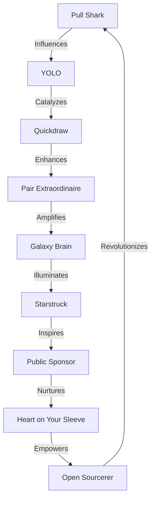

# 🌟 The GitHub Badge Multiverse: A New Dimension of Achievements 🌠

Welcome to a revolutionary approach to GitHub Profile Badges! Prepare to embark on a journey that transcends traditional achievement systems. This isn't just a list; it's an interactive, evolving ecosystem of accomplishments!

## 🌈 Holographic Table of Contents

- [🔮 The Badge Nexus](#-the-badge-nexus)
- [🧠 Neural Badge Network](#-neural-badge-network)
- [🎭 Quantum Badge States](#-quantum-badge-states)
- [🌋 Dynamic Challenge Volcanoes](#-dynamic-challenge-volcanoes)
- [🧬 Community-Driven Badge Evolution](#-community-driven-badge-evolution)
- [💠 Hyperdimensional Contribution Matrix](#-hyperdimensional-contribution-matrix)
- [🎨 Badge Fusion Artistry](#-badge-fusion-artistry)
- [🚀 Propel Our Vision](#-propel-our-vision)

## 🔮 The Badge Nexus

Behold, the central hub of our badge multiverse! Each badge is a living entity, interconnected with others in ways never before imagined.

| Badge Cluster | Core Badges | Synergy Level | Dimensional Influence |
|---------------|-------------|----------------|------------------------|
| Quantum Coders |    | Entangled | Code Spacetime Manipulation |
| Collaborative Cosmos |   | Harmonic | Hive-Mind Coding |
| Open Source Nebula |   | Radiant | Project Gravity Wells |
| Heart of Code |   | Resonant | Empathic Debugging |

## 🧠 Neural Badge Network

Our badges are now interconnected in a neural network, learning and evolving based on community interactions!



## 🎭 Quantum Badge States

Badges now exist in quantum states, changing based on observation and interaction!

| Badge | State A | State B | State C | Collapse Trigger |
|-------|---------|---------|---------|------------------|
| Pull Shark | 🦈 Code Predator | 🌊 Merge Surfer | 🕳️ Quantum Tunneler | PR Complexity |
| YOLO | 🎭 Chaos Agent | 🛡️ Risk Mitigator | 🔮 Future Glimpser | Merge Success Rate |
| Quickdraw | ⚡ Speed Daemon | 🕰️ Time Bender | 🌟 Efficiency Nexus | Issue Resolution Time |
| Pair Extraordinaire | 🤝 Sync Sorcerer | 🧠 Mind Melder | 🌌 Gestalt Coder | Collaboration Frequency |

## 🌋 Dynamic Challenge Volcanoes

Introducing Challenge Volcanoes: Dynamic, erupting tasks that reshape the badge landscape!

```python
class ChallengeVolcano:
    def __init__(self, name, difficulty, rewards):
        self.name = name
        self.difficulty = difficulty
        self.rewards = rewards
        self.active = False

    def erupt(self):
        self.active = True
        print(f"🌋 The {self.name} Volcano has erupted! Difficulty: {self.difficulty}")
        print(f"🏆 Potential rewards: {', '.join(self.rewards)}")

    def complete_challenge(self, user):
        if self.active:
            print(f"🎉 {user} has conquered the {self.name} Volcano!")
            return self.rewards
        else:
            print("This volcano is dormant. Wait for the next eruption!")

# Example usage
quantum_refactor = ChallengeVolcano("Quantum Refactor", "Extreme", ["Quantum Coder Badge", "Code Dimension Warper Title"])
quantum_refactor.erupt()
rewards = quantum_refactor.complete_challenge("CodingWizard123")
```

## 🧬 Community-Driven Badge Evolution

Badges now evolve based on community input! Propose new traits, vote on mutations, and watch badges transform!

| Badge | Current Form | Proposed Evolution | Votes | Mutation Progress |
|-------|--------------|---------------------|-------|-------------------|
| Pull Shark | 🦈 Code Predator | 🐙 Merge Kraken | 256 | [=========>---] 72% |
| Galaxy Brain | 🧠 Thought Nexus | 🌌 Cosmic Consciousness | 189 | [======>------] 58% |
| Heart on Your Sleeve | 💖 Empathy Beacon | 🌈 Emotional Spectrum Master | 134 | [====>--------] 41% |

## 💠 Hyperdimensional Contribution Matrix

Your contributions now ripple across dimensions! View your impact across multiple planes of development existence.

| Dimension | Contribution Type | Ripple Effect | Multiversal Impact Score |
|-----------|-------------------|---------------|--------------------------|
| Code Realm | Pull Requests | Bug Butterfly Effect | 78.3 |
| Idea Plane | Discussions | Thought Cascades | 92.7 |
| Community Nexus | Issue Resolution | Helper Harmonics | 86.5 |
| Documentation Dimension | Wiki Edits | Knowledge Novas | 63.9 |
| Test Continuum | Unit Tests | Bug Extinction Events | 71.2 |

## 🎨 Badge Fusion Artistry

Express your unique coding style by fusing badges into personalized masterpieces!

| Base Badge | + | Catalyst Badge | = | Fused Creation | Special Ability |
|------------|---|----------------|---|----------------|-----------------|
| Pull Shark | + | Quickdraw | = | 🌪️ Merge Typhoon | PR Velocity Fields |
| Galaxy Brain | + | Heart on Your Sleeve | = | 🌠 Empathic Supernova | Emotional Code Optimization |
| YOLO | + | Pair Extraordinaire | = | 🎭 Quantum Pair Programming | Schrödinger's Code Review |

## 🚀 Propel Our Vision

Help us push the boundaries of what's possible with GitHub badges! Your contributions fuel our journey to revolutionize developer recognition.

- 🌟 Star this repository to increase its gravitational pull!
- 🍴 Fork and propose new multidimensional badges!
- 🐛 Uncover bugs in the fabric of our badge reality!
- 💡 Illuminate new paths in our issue discussions!

### 💖 Support the Multiversal Expansion

Fuel our cosmic innovation engine with a contribution:
`0x3A06322e9F1124F6B2de8F343D4FDce4D1009869`

Every contribution warps the fabric of our badge spacetime, accelerating evolution!

---

🌌 Dive into the GitHub Badge Multiverse and transcend traditional achievements! 🚀
